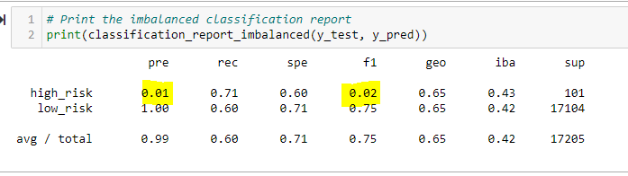
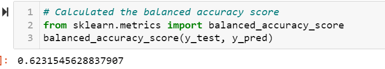
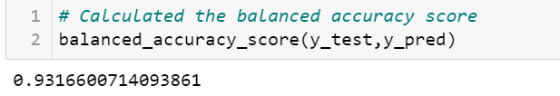
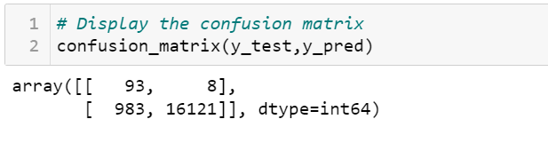

# Credit_Risk_Analysis

## Overview of the analysis

Jill commends you for all your hard work. Piece by piece, you’ve been building up your skills in data preparation, statistical reasoning, and machine learning. You are now ready to apply machine learning to solve a real-world challenge: credit card risk.

Credit risk is an inherently unbalanced classification problem, as good loans easily outnumber risky loans. Therefore, you’ll need to employ different techniques to train and evaluate models with unbalanced classes. Jill asks you to use imbalanced-learn and scikit-learn libraries to build and evaluate models using resampling.

Using the credit card credit dataset from LendingClub, a peer-to-peer lending services company, you’ll oversample the data using the RandomOverSampler and SMOTE algorithms, and undersample the data using the ClusterCentroids algorithm. Then, you’ll use a combinatorial approach of over- and undersampling using the SMOTEENN algorithm. Next, you’ll compare two new machine learning models that reduce bias, BalancedRandomForestClassifier and EasyEnsembleClassifier, to predict credit risk. Once you’re done, you’ll evaluate the performance of these models and make a written recommendation on whether they should be used to predict credit risk.

## Results
### Deliverable 1: 

#### Use Resampling Models to Predict Credit Risk 

Using the information  provided  created training and target variables by completing the following steps:

- Created the training variables by converting the string values into numerical ones using the get_dummies() method.

- Created the target variables.

- Check the balance of the target variables.

  

Next,  resampled the training data:

 First, used the oversampling "RandomOverSampler" and "SMOTE algorithms" to resample the data

### Oversampling

#### <u> Random Over Sampler</u>

In random oversampling, instances of the minority class are randomly selected and added to the training set until the majority and minority classes are balanced

   - Balance accuracy score:

      

    - ConfusionMatrix:

    - Classification Report:

The "High Risk" precision rate is very low  1% with the recall at 71% giving  an F1 score of 2%.But the "Low Risk" had a precision rate of 100% and recall at 62%.

In this project we are considering High Risk Credit Card analysis so the RandomOverSampler is not best fit for this project.

 - #### <u>SMOTE Algorithm</u>

The synthetic minority oversampling technique (SMOTE) is another oversampling approach to deal with unbalanced datasets. In SMOTE, like random oversampling, the size of the minority is increased. In SMOTE, by contrast, new instances are interpolated. That is, for an instance from the minority class, a number of its closest neighbors is chosen. Based on the values of these neighbors, new values are created

    - Balance accuracy score:

     
    - ConfusionMatrix:

    -  Classification Report:

Comparing with Random sampling with SMOTE ,there is no significant diference of precision,recall or f1score for High Risk. But th Low Risk recall has been increased to 695 with 75% f1 score. 

### Undersampling

- #### <u>ClusterCentroids algorithm</u>

Cluster centroid undersampling is akin to SMOTE. The algorithm identifies clusters of the majority class, then generates synthetic data points, called centroids, that are representative of the clusters. The majority class is then undersampled down to the size of the minority class.

    - Balance accuracy score:

   - ConfusionMatrix:
   

 
   -  Classification Report:

The "High Risk" precision rate again was only at 1% with the recall at 69% giving this model an F1 score of 1%.
"Low Risk" had a precision rate of 100% and with a lower recall at 40% compared to the oversampling models

## Diliverable 2:

#### <u>SMOTEENN algorithm</u>

SMOTEENN combines the SMOTE and Edited Nearest Neighbors (ENN) algorithms.

In this section, I tested a combination over- and under-sampling algorithm to determine if the algorithm results in the best performance compared to the other sampling algorithms above. 

 - Balance accuracy score
  
    

- Confusion Metrix:

   

 - Classification Report

   

The "High Risk" precision rate did not improve was only 1%, however the  F1 score has increased to of 2%.
"Low Risk" still showed a precision rate of 100% with the recall at 59%.

### Diliverable 3:

### Ensemble Learners

In this section, I compared two ensemble algorithms to determine which algorithm results in the best performance. I have trained a Balanced Random Forest Classifier and an Easy Ensemble AdaBoost classifier .

#### <u>Balanced Random Forest Classifier</u>

A balanced random forest randomly under-samples each boostrap sample to balance it.

- Balance accurasy score

   

- Confusion Metrix

   

- Classification Report

   

 
 Looking at above figures we can say there is significance impreovement in this module ,Random forest classifier.
 Balance accuracy score has been increased to 78%.Precision value for high risk incresed from 1%/ to 3% and recall value increased to 70% resusting f1 score of 6%.

 The importance of a feature is computed as the (normalized) total reduction of the criterion brought by that feature.

 

#### <u>Easy Ensemble AdaBoost classifier</u>

This algorithm is known as EasyEnsemble. The classifier is an ensemble of AdaBoost learners trained on different balanced boostrap samples. The balancing is achieved by random under-sampling

- Balance accuracy score

- Confusion Metrix

- Classification Report

Comparing with all other algorithems this one has given best values with 93% balane accuracy score and 9% highrisk precision recall 92% resulsing 16% of f1 score.

## Summary

                       accuracy    precision     recall     f1 score

EasyEnsembleClassifer:&nbsp;&nbsp;&nbsp;&nbsp;&nbsp;   93.16%&nbsp;&nbsp;&nbsp;&nbsp;&nbsp;&nbsp;&nbsp;&nbsp;&nbsp;&nbsp;&nbsp;&nbsp;  9% &nbsp;&nbsp;&nbsp;&nbsp;&nbsp;&nbsp;&nbsp;&nbsp;&nbsp;&nbsp;&nbsp;&nbsp; &nbsp;&nbsp;&nbsp;&nbsp; &nbsp;&nbsp;&nbsp;&nbsp;           92% &nbsp;&nbsp;&nbsp;&nbsp;&nbsp;&nbsp;&nbsp;&nbsp;&nbsp;&nbsp;&nbsp;&nbsp; &nbsp;&nbsp;       16%

RandomForestClassifer:

SMOTE:&nbsp;&nbsp;&nbsp;&nbsp;&nbsp;&nbsp;&nbsp;&nbsp;&nbsp;&nbsp;&nbsp;&nbsp;&nbsp;&nbsp;&nbsp;&nbsp;&nbsp;&nbsp;&nbsp;&nbsp;&nbsp;&nbsp;&nbsp;&nbsp;&nbsp;&nbsp;&nbsp;&nbsp;&nbsp;&nbsp;&nbsp;&nbsp;&nbsp;66%&nbsp;&nbsp;&nbsp;&nbsp;&nbsp;&nbsp;&nbsp;&nbsp;&nbsp;&nbsp;&nbsp;&nbsp;&nbsp;&nbsp;&nbsp;&nbsp;&nbsp;&nbsp;&nbsp;1%&nbsp;&nbsp;&nbsp;&nbsp;&nbsp;&nbsp;&nbsp;&nbsp;&nbsp;&nbsp;&nbsp;&nbsp;&nbsp;&nbsp;&nbsp;&nbsp;&nbsp;&nbsp;&nbsp;&nbsp;&nbsp;63%&nbsp;&nbsp;&nbsp;&nbsp;&nbsp;&nbsp;&nbsp;&nbsp;&nbsp;&nbsp;&nbsp;&nbsp;&nbsp;&nbsp;&nbsp;&nbsp;&nbsp;&nbsp;2%

SMOOTEN:&nbsp;&nbsp;&nbsp;&nbsp;&nbsp;&nbsp;&nbsp;&nbsp;&nbsp;&nbsp;&nbsp;&nbsp;&nbsp;&nbsp;&nbsp;&nbsp;&nbsp;&nbsp;&nbsp;&nbsp; &nbsp;&nbsp;&nbsp;&nbsp;&nbsp; 62.31%&nbsp;&nbsp;&nbsp;&nbsp;&nbsp;&nbsp;&nbsp;&nbsp;&nbsp;&nbsp;&nbsp;&nbsp;&nbsp;&nbsp;1%&nbsp;&nbsp;&nbsp;&nbsp;&nbsp;&nbsp;&nbsp;&nbsp;&nbsp;&nbsp;&nbsp;&nbsp;&nbsp;&nbsp;&nbsp;&nbsp;&nbsp;&nbsp;&nbsp;&nbsp;&nbsp;&nbsp;&nbsp;65%&nbsp;&nbsp;&nbsp;&nbsp;&nbsp;&nbsp;&nbsp;&nbsp;&nbsp;&nbsp;&nbsp;&nbsp;&nbsp;&nbsp;&nbsp;&nbsp;&nbsp;&nbsp;2%

RandomOverSampler:

ClusterCentroids: